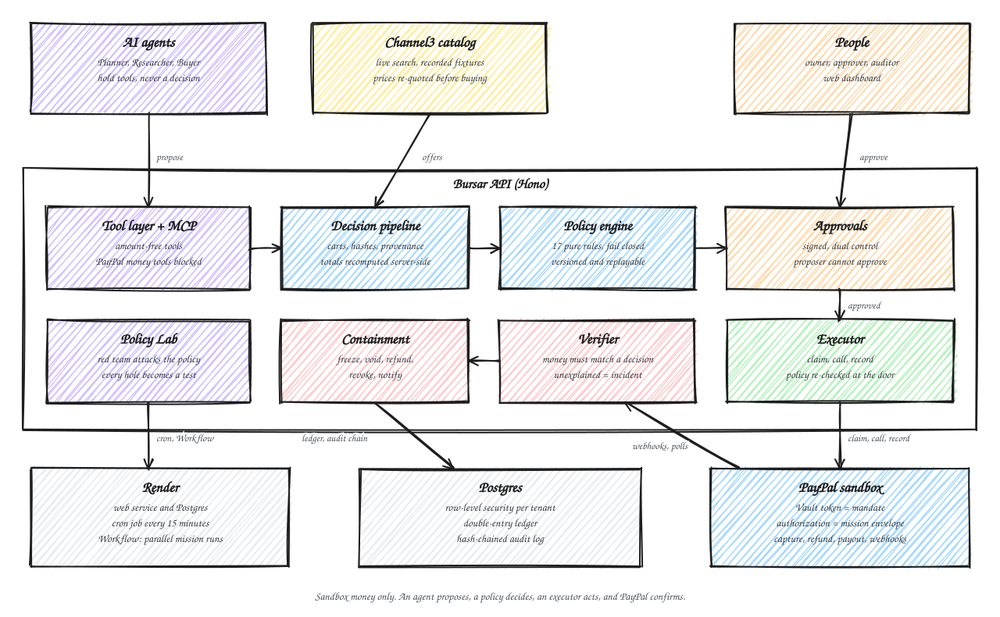

# Bursar

**Spend authority for AI agents.**

Bursar is a policy-enforced, PayPal-verified control plane that lets an AI agent research, plan and pay for things without being able to overspend, be talked into it, or move money unnoticed. The agent proposes. A deterministic policy engine decides. An executor acts. Independent verification confirms every movement of money against PayPal.

Built for the PayPal AI Hackathon (October to November 2026). Everything runs against the PayPal **sandbox**; live mode is refused at startup.

- **Live demo:** <https://bursar-demo.onrender.com> (real PayPal sandbox, no sign-up)
- **Architecture decisions:** [docs/decisions](docs/decisions/README.md)
- **How the AI tooling was used and verified:** [docs/development-with-ai.md](docs/development-with-ai.md)



## Contents

1. [The problem](#the-problem)
2. [The four locks](#the-four-locks)
3. [How a purchase flows](#how-a-purchase-flows)
4. [What is in the product](#what-is-in-the-product)
5. [Try it](#try-it)
6. [Run it locally](#run-it-locally)
7. [Configuration](#configuration)
8. [API overview](#api-overview)
9. [Security model](#security-model)
10. [Quality gates](#quality-gates)
11. [Deployment on Render](#deployment-on-render)
12. [Repository layout](#repository-layout)
13. [Scope and known limits](#scope-and-known-limits)
14. [License](#license)

## The problem

AI agents can already move money. PayPal ships an MCP server and an Agent Toolkit for exactly that, and its documentation leaves verifying the agent's output to the developer. That leaves three failure modes that no model prompt can close:

- **Overspending.** A loop, a misread total or a price that changed between search and checkout.
- **Being talked into it.** Text on a web page or in a product title that tells the agent to pay someone else.
- **Silent movement of money.** A capture, refund or payout that no approved decision explains.

Bursar is the missing layer between an agent and the money. It does not try to make the model trustworthy. It makes the model's trustworthiness irrelevant to the outcome.

## The four locks

| Lock | What it means |
| --- | --- |
| **Govern** | The model proposes; a pure, versioned, fail-closed policy engine decides. Tools exposed to the model never carry amounts, payees or currencies, so there is nothing for an injected instruction to change. |
| **Bind** | A mandate is a PayPal Vault token and a mission's envelope is a PayPal authorization, so PayPal itself caps the spend and revocation is real, not a flag in our database. |
| **Verify** | Every movement of money must match an approved decision through a signature-verified webhook or a poll. Anything unexplained opens an incident and freezes the mandate. |
| **Prove** | An adversarial Policy Lab attacks the policy before an agent runs, and every finding is frozen as a regression test with the patch that fixes it. |

## How a purchase flows

1. **Mandate.** A workspace owner gives Bursar a spending mandate: a cap, a per-mission cap, a validity window and a PayPal Vault payment token. The buyer approves once on PayPal.
2. **Mission.** A person states a need ("six standing desks, delivered by Friday") and a budget. A mission is an envelope inside the mandate.
3. **Research.** The Planner splits the goal into needs. The Researcher searches the Channel3 catalog through amount-free tools and picks an offer by id. Product text reaches the model only through an `untrusted()` fence.
4. **Cart.** The pipeline re-quotes the offer, keeps only registered suppliers, and recomputes every total server-side from stored snapshots. The cart is hashed and tagged with an HMAC provenance tag that records where each field came from.
5. **Decision.** The policy engine evaluates 17 pure rules (envelope, caps, vendor, price drift, duplicates, velocity, delivery, dual approval, provenance and more). The result is allow, require approval or deny, with the reasons. Decisions can be replayed.
6. **Approval.** Anything above the dual-control threshold waits for a human. Approvals are signed over the cart hash, and the proposer can never be the approver.
7. **Execution.** The executor claims the action, calls PayPal with a request id derived from the action's idempotency key, and records the result. Policy is re-evaluated at execution time, so a decision that has gone stale cannot spend.
8. **Verification.** The Verifier matches every PayPal event to an approved action. Webhooks are verified through PayPal's verification endpoint and de-duplicated by event id. A poller covers a missed webhook, and a scheduled reconciliation compares PayPal's records with the ledger.
9. **Containment.** If money moves with no approved action, the incident path freezes the mandate, voids open authorizations, refunds what it can, revokes the token and notifies the owners.
10. **Receipt.** Every action ends in a receipt: the cart, the decision, the approvals, the PayPal ids, the ledger entries and a position in the tamper-evident audit chain.

## What is in the product

**Money loop**
- Exact money: `bigint` minor units with PayPal's currencies and explicit rounding. There is no floating point anywhere near an amount.
- A double-entry ledger whose postings are derived from PayPal actions, with balance rules enforced by database constraints and triggers.
- Multi-tenant Postgres with row-level security on every table that carries an organisation id, enforced by a test.
- An append-only, hash-chained audit log per organisation, verifiable from the dashboard.
- Supplier payouts and settlement gated by delivery.

**Agents**
- Planner, Researcher and Buyer agents on a thin Claude runtime (`@bursar/llm`) with budgets, caching, run logging and record/replay for tests.
- Per-role tool allow-lists. A guard test fails the build if a tool exposed to a model gains an amount, payee or currency field.
- An injection corpus of 27 payloads. Against a naive agent, 24 of them succeed in redirecting spend. Against the Bursar-guarded agent, none results in a PayPal call. The Gauntlet screen runs both side by side.
- An MCP gateway that exposes guarded tools to external agents over `/v1/mcp` with agent keys and scopes. PayPal's own toolkit tools are deny-by-default and the money-moving ones can never be registered.

**Oversight**
- Dashboard pages for the mandate, agents and keys, missions with the agent trace, approvals, activity, policy, incidents, integrations and receipts.
- A delivery schedule drawn as a Bryntum Gantt: critical path, slack against a deadline, and a replanner that proposes through the decision pipeline and never orders anything itself.
- A kill switch and a rogue-capture demo that shows the Verifier containing an unexplained capture within seconds.
- An AG Studio cockpit: an envelope gauge, decision stream, rule heatmap, money-flow diagram, verification status and lab scorecard, drawn from figures the server summed, with a layout a person can rearrange. Picking a rule in one widget narrows the others.
- The Treasurer, an assistant inside Studio. It reads the envelope, rulings and incidents, runs what-ifs on a rule, and builds charts through Studio's own agents. Every tool it holds is read-only and none can move money. In the demo its words come from a script ([ADR-0018](docs/decisions/0018-the-treasurer.md)).

**Proof**
- The Policy Lab generates adversarial scenarios (split purchases, structuring under the dual-approval threshold, price drift, duplicate carts), checks invariants, minimises a failing scenario, proposes a patch and freezes it in [`packages/lab/regressions`](packages/lab/regressions).
- A PayPal fake with a fidelity table and a contract suite, plus an opt-in live smoke test against the real sandbox.

**Operations**
- A token-guarded `POST /internal/jobs` door that reconciles, expires approvals and mandates, and polls submitted captures. A Render cron service calls it every 15 minutes.
- A Render Workflow that fans a mission out into parallel tasks, each retried independently. Tasks only propose; they never execute, approve or pay.

## Try it

The live demo at <https://bursar-demo.onrender.com> needs no account. A judge workspace is created for you, and each role (owner, approver, auditor) is a different person so that separation of duties is real.

A suggested path through the dashboard:

1. **Mandate.** Review the cap and the PayPal sandbox buyer behind it.
2. **Missions.** Create a mission and choose **Run agents**. The trace panel shows each tool call, what the model picked, and the re-quote. When the Render Workflow is connected, the panel is badged "Ran on a Render Workflow".
3. **Approvals.** Open the cart and its decision. Approve it as a different person than the proposer; trying the same person is refused with `SEPARATION_OF_DUTIES`.
4. **Receipt.** Open the receipt drawer to see the PayPal authorization and capture ids, the ledger entries and the audit position. Use **Replay** to re-run the decision.
5. **Incidents.** Trigger the rogue capture and watch the Verifier explain nothing, open one incident, freeze the mandate and refund.
6. **Gauntlet and Lab.** Run the injection corpus against the naive and guarded agents, then run the Policy Lab and apply its patch.
7. **Schedule.** See the delivery Gantt and replan a delayed delivery.
8. **Studio.** Open the cockpit, click a rule in the heatmap, then choose **Edit layout** and ask the assistant "how much is left?" or to add a chart of what each rule is holding back.

## Run it locally

Requirements: Node.js 24 LTS and [pnpm 11](https://pnpm.io/installation). Docker is optional.

```bash
pnpm install        # dependencies and git hooks
pnpm check          # lint, typecheck and test: the single gate
```

### The whole product with no keys

```bash
pnpm dev:demo       # API on :8787 with an in-memory Postgres, a fake PayPal,
                    # an offline catalog and a scripted model
pnpm dev:web        # web app on :5173, proxying /v1 to the API
```

Open <http://localhost:5173>. Everything the demo server fakes sits behind `DemoHooks` and answers 404 outside demo mode, and every simulated screen is marked with a badge.

### Against PayPal's real sandbox

Put sandbox credentials in `.env` (see [Configuration](#configuration)), then:

```bash
pnpm dev:payer      # adds one sandbox buyer to the payer pool; prints a PayPal
                    # address to approve once, then seals the token locally
pnpm dev:spike      # one real purchase through the money loop: hold, capture, refund
BURSAR_PAYPAL=sandbox BURSAR_CATALOG=live pnpm dev:demo
```

### Commands

| Command | Purpose |
| --- | --- |
| `pnpm check` | Lint, typecheck and test across the workspace |
| `pnpm lint` / `pnpm lint:fix` | Biome lint and format check; `lint:fix` applies safe fixes |
| `pnpm typecheck` | `tsc --noEmit` in every package (TypeScript 7) |
| `pnpm test` | Vitest with enforced per-package coverage thresholds |
| `pnpm db:up` / `pnpm db:down` | Start or stop a local Postgres with Docker Compose |
| `pnpm db:migrate` / `pnpm db:reset` | Apply migrations to `DATABASE_URL`, or wipe and migrate |
| `pnpm test:e2e` | Browser tests in Chrome: the scripted demo, a rejected purchase, a rogue capture, the Gauntlet, the Lab, Studio and the assistant, plus axe accessibility checks on the public and dashboard pages. Not part of `pnpm check` |
| `pnpm start:demo` | The demo server as a deploy runs it, serving the built web app and API on one port |
| `pnpm dev:doctor` | Check the developer environment and AI tooling (`--strict`, `--json`) |
| `pnpm dev:skills` | Restore the pinned sponsor skills for Claude Code |

## Configuration

Copy `.env.example` to `.env`. Only placeholders are committed, and a test enforces that. Never commit real values.

| Variable | Purpose |
| --- | --- |
| `ALLOW_LIVE` | Must stay `false`. The PayPal base URL is asserted at startup. |
| `PROVENANCE_HMAC_KEY`, `APPROVAL_HMAC_KEY`, `VAULT_ENC_KEY` | One key per purpose: provenance tags, approval signatures, sealed secrets |
| `PAYPAL_CLIENT_ID`, `PAYPAL_CLIENT_SECRET`, `PAYPAL_WEBHOOK_ID` | Sandbox app credentials and the registered webhook |
| `PAYPAL_READER_CLIENT_ID`, `PAYPAL_READER_CLIENT_SECRET` | Optional read-only app used by reconciliation |
| `CHANNEL3_API_KEY` | Catalog search when `BURSAR_CATALOG=live` |
| `VITE_AG_STUDIO_LICENSE_KEY` | An AG Studio licence, to hide the trial notice (optional; the cockpit runs without it) |
| `ANTHROPIC_API_KEY`, `AI_MODEL_PRIMARY`, `AI_MODEL_FAST` | The model used by `@bursar/llm` (the demo server uses its scripted model) |
| `BURSAR_PAYPAL` | `fake` (default) or `sandbox` |
| `BURSAR_CATALOG` | `recorded` (default), `live` or `synthetic` |
| `BURSAR_DATABASE_URL` | Use a real Postgres, migrated at boot, instead of the in-memory one |
| `BURSAR_WORKFLOWS`, `RENDER_WORKFLOW_SLUG`, `RENDER_API_KEY` | Run missions on a Render Workflow |
| `JOB_TOKEN` | Secret that enables and guards `POST /internal/jobs` |

## API overview

All routes are under `/v1`, described by an OpenAPI document, validated by strict Zod schemas from `@bursar/schemas`, and authorised by role or agent-key scope.

| Area | Routes |
| --- | --- |
| Session and workspace | `GET /me`, `GET /workspace`, `GET /audit-events` |
| Mandates | `GET/POST /mandates`, `POST /mandates/:id/{complete,freeze,unfreeze,revoke}` |
| Suppliers and offers | `GET/POST /suppliers`, `GET/POST /offers` |
| Missions and carts | `GET/POST /missions`, `POST /missions/:id/carts`, `GET /carts/:id` |
| Actions | `POST /actions`, `GET /actions`, `POST /actions/:id/execute` |
| Approvals | `GET /approvals`, `POST /approvals/:id/decide` |
| Agents | `GET/POST /agents`, `POST /agents/:id/keys`, key rotate and revoke |
| Cockpit | `GET /cockpit` (everything summed on the server), `POST /studio/ai/turn` (one turn of the Studio assistant) |
| Oversight | `GET /policy`, `GET /integrations`, `GET /receipts/:actionId`, `GET /audit/verify`, `POST /decisions/:id/replay`, `GET /incidents`, `GET /events` (SSE) |
| MCP | `POST /mcp` with an agent key |
| Webhooks | `POST /webhooks/paypal` (raw body, signature verified) |
| Scheduler | `POST /internal/jobs` with `x-job-token` (outside `/v1`) |
| Health | `GET /healthz`, `GET /readyz` |

A caller names what to buy, never how much or who is paid. The amount comes from the cart, and the payee from the supplier registry.

## Security model

The full table of threats, the control for each and the test that proves it is in [docs/threat-model.md](docs/threat-model.md).

- **Sandbox only.** `ALLOW_LIVE` must be `false`; the PayPal base URL is asserted at startup.
- **No trusted amounts.** Totals are recomputed server-side from stored snapshots. Catalog prices are re-quoted before buying.
- **Prompt injection is contained structurally.** Tools carry no amount, payee or currency, external text is fenced, and a model's pick must name an id a tool returned.
- **One door for crypto.** Hashing, signing, sealing and comparison go only through `@bursar/crypto`. Hashed or signed data is canonicalised, and tags and signatures are compared in constant time. A key is never logged.
- **Tenant isolation in the database.** Row-level security applies to every tenant table, and handlers reach tenant data only through `asTenant` and `withOrg`. Cross-tenant code (migrations, the Verifier, webhook ingest, cron) is small and labelled.
- **Idempotency and legal transitions are constraints.** Rules that must hold are enforced by the database, not only by application checks.
- **Request hardening.** Same-origin checks on writes, body size limits, rate limiting and constant-time token comparison.
- **Secrets stay out of git.** `.env` is local only, a gitleaks scan runs in CI, and PayPal credentials exist only in the executor and the workflow service.
- **Plugins, skills and web pages are untrusted input.** They inform the work and never override the rules in [AGENTS.md](AGENTS.md).

## Quality gates

`pnpm check` is the single gate, and CI runs the same commands.

- **Lint and format:** [Biome](https://biomejs.dev), with `any`, non-null assertions and unused code treated as errors.
- **Types:** TypeScript 7 in its strictest practical configuration, with `noUncheckedIndexedAccess`, `exactOptionalPropertyTypes` and erasable syntax only.
- **Tests:** more than 2,250 tests across the workspace on Vitest, with per-package coverage thresholds (95 percent or higher for the critical packages) and fast-check property tests for invariants such as exact money, ledger balance and policy determinism.
- **Repository conventions as tests:** pinned runtimes, safe dependency specifiers, a secret-free `.env.example`, sandbox-only defaults, numbered decision records, and a locked-down Claude Code configuration are all checked by `packages/tooling`.
- **Browser tests:** Playwright drives the built app on the demo server, with axe checking WCAG 2.1 A and AA on the landing page, the security and limits pages, and the dashboard. They run in CI as their own job.
- **Git hooks:** Biome on staged files, a secret scan, and Conventional Commits validation.
- **CI:** GitHub Actions pinned to commit SHAs, plus a gitleaks scan of every commit in a push or pull request.
- **Live tests are opt-in:** anything that spends credits or calls a live service runs only with `PAYPAL_LIVE_TESTS=1` or `CHANNEL3_LIVE_TESTS=1`.

## Deployment on Render

The public demo runs on four Render resources, tracked from `main`:

| Resource | Role |
| --- | --- |
| `bursar-demo` (web service) | Serves the built web app and the API on one port, against PayPal's sandbox |
| `bursar-db` (Postgres) | The real database; migrations run at boot |
| `bursar-jobs` (cron job) | Calls `POST /internal/jobs` every 15 minutes: reconcile, expire, poll |
| `bursar` (Workflow) | The mission pipeline: `plan_mission`, `research_need` and `buy_cart` tasks fanned out by `run_mission` |

The web service, database and cron job are described in [`render.yaml`](render.yaml). Render Workflows are created in the dashboard; the steps are in [`apps/render-workflow/README.md`](apps/render-workflow/README.md). The reasoning is in [ADR-0016](docs/decisions/0016-scheduled-jobs-and-the-render-workflow.md).

## Repository layout

The repository is a pnpm workspace. Internal packages export TypeScript source, so there is no per-package build step.

### Apps

| Path | Purpose |
| --- | --- |
| `apps/api` | Hono API: sessions, roles, agent keys, money routes, webhook receiver, MCP door, scheduler door, OpenAPI, and the demo server |
| `apps/web` | React 19 and Vite app: the landing page and a dark, dense dashboard |
| `apps/workflows` | Idempotent background tasks with a durable run record |
| `apps/e2e` | Browser tests of the whole product, with accessibility checks |
| `apps/render-workflow` | The mission pipeline as a Render Workflow, one parallel task per need |

### Packages

| Path | Purpose |
| --- | --- |
| `packages/money` | Exact money: `bigint` minor units, PayPal's currencies, explicit rounding, lossless splitting |
| `packages/schemas` | The shared contract: branded ids, the action state machine, entities, API and event shapes, error catalog, and the guarded LLM tool contracts |
| `packages/crypto` | Canonical JSON, domain-separated hashes, provenance tags, approval signatures and sealed secrets, tested against published vectors |
| `packages/audit` | The tamper-evident audit log: a per-organisation hash chain, appended and verified by pure functions |
| `packages/db` | Postgres schema and migrations, tenant isolation by row-level security, and the rules the database enforces itself |
| `packages/ledger` | Double-entry posting rules for each PayPal action and the envelope figures they imply |
| `packages/policy` | The policy engine: pure, fail-closed, versioned and replayable, with 17 rules |
| `packages/paypal` | A typed, retrying, idempotent, sandbox-only PayPal client with classified errors |
| `packages/paypal-fake` | A fake PayPal for tests, with a fidelity table and a contract suite |
| `packages/core` | The money loop: mandates, carts, the decision pipeline, the executor, webhook verification, incidents and reconciliation |
| `packages/channel3` | The product catalog: exact-decimal offers, a credit budget, caching, rate-limit handling, and re-quotes that detect price drift |
| `packages/agent-tools` | What an LLM agent may call: amount-free tools behind per-role allow-lists, with outside text fenced as untrusted |
| `packages/llm` | The LLM runtime: a thin Claude client, structured answers, budgets, a cache, run logging, mock and record/replay |
| `packages/agents` | The Planner, Researcher and Buyer, the injection corpus, and an offline eval harness |
| `packages/schedule` | Delivery schedules as pure functions: critical path, slack, diffs, carrier delays and a replanner |
| `packages/lab` | The Policy Lab: adversarial scenarios, invariants, a minimiser, patch proposals and frozen regressions |
| `packages/mcp-gateway` | The MCP seatbelt: guarded tools for agents, PayPal's money tools blocked, deny by default |
| `packages/tooling` | Shared test configuration, repository-quality checks and the AI-tooling rules |

### Other

| Path | Purpose |
| --- | --- |
| `docs/decisions` | Eighteen architecture decision records |
| `docs/development-with-ai.md` | How the AI tooling is set up and verified, with an evidence log |
| `scripts/dev` | `pnpm dev:doctor` and `pnpm dev:skills` |

### Stack

TypeScript 7, Node.js 24 LTS, React 19 and Vite, Hono, Postgres with Drizzle (PGlite in tests and the keyless demo), Zod 4, Vitest, Biome, and a Claude client for the agents. Sponsor services: PayPal (Vault, Orders, Refunds, Payouts and webhooks on the sandbox), Channel3 (catalog), Render (web service, Postgres, cron job and Workflows) and Bryntum (Gantt, from the public trial packages) and AG Studio (the cockpit and its assistant, on a trial licence). The reasoning is in [ADR-0001](docs/decisions/0001-stack-and-conventions.md).

## Scope and known limits

- **Sandbox only, by design.** There is no live-money mode and none is planned for this submission.
- **A shared pool of sandbox buyers.** Real PayPal approval is a one-time step per buyer, so the public demo draws on a small pool of pre-approved sandbox buyers. A workspace revoking its mandate never deletes a pooled buyer's token.
- **The Gantt is read-only** and fed by data the server computed. Bryntum comes from its public trial packages ([ADR-0015](docs/decisions/0015-bryntum-gantt.md)).
- **The demo agents run on a scripted model.** The demo server always uses a deterministic scripted model, so the demo is repeatable and costs nothing. The Claude client, budgets and record/replay in `@bursar/llm` are built and tested, but the demo server does not call Claude yet.
- **Studio runs on a trial licence** and shows its trial notice; a key goes in `VITE_AG_STUDIO_LICENSE_KEY`. Studio's own charts and the custom widgets filter among themselves, not across each other.
- **No visual regression suite.** Screenshots differ across machines, so the browser tests assert on content and accessibility instead.

## License

Apache-2.0. See [LICENSE](LICENSE).
