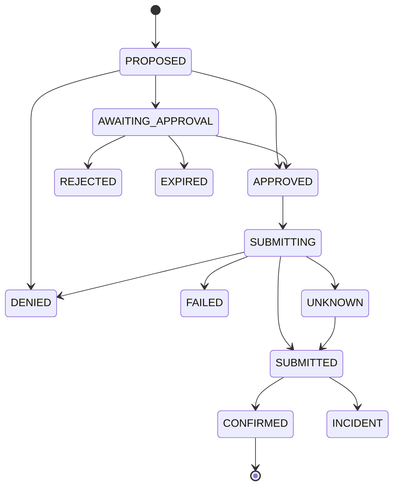

# @bursar/schemas

The shared contract for Bursar. Every identifier, state, entity, request, event, error and LLM tool that crosses a package boundary or the wire is defined once, here, as a [Zod](https://zod.dev) schema. The TypeScript types, runtime validation, JSON Schema and (later) OpenAPI all come from that one definition.

```ts
import { newId, mandateSchema, canTransition, problem, inspectTools } from '@bursar/schemas';

newId('action'); // 'act_01K7Z9Y3QXG8M2V5N4R6T1B0CD': a branded ActionId, sortable by time
mandateSchema.parse(json); // throws unless every field, and every rule between fields, holds
canTransition('SUBMITTED', 'CONFIRMED'); // true; canTransition('PROPOSED', 'CONFIRMED') is false
problem('POLICY_DENIED', { detail: 'R-ENVELOPE: …' }); // an RFC 9457 error body with a stable code
inspectTools(); // [] while no LLM tool can name an amount, a currency or a payee
```

## What it guarantees

| Guarantee | How it is enforced |
| --- | --- |
| **An id says what it is** | Every id is `<prefix>_<ULID>`. A mission id passed where an action id is expected fails validation at the boundary instead of reaching the wrong table. |
| **Illegal states cannot be represented** | Entity schemas carry the rules the architecture states: the Verifier can never spend, a cart's total is the sum of its lines, a decision is exactly as strict as its strictest rule, an approval is signed exactly when approved. |
| **An action only moves forward** | `ACTION_TRANSITIONS` is the one table of legal moves; it has no cycles, and the database enforces the same table. |
| **No unknown fields, anywhere** | Every object is strict, so a client that sends a field the server does not know is told. |
| **One mistake, one message** | A rule spanning several fields runs only once every field is valid on its own, and overlapping checks abort early. |
| **A model can never name money** | LLM tools take ids, bounded counts and short text, never an amount, a currency or a payee, and a guard test fails if one ever does. |
| **The JSON Schema is faithful** | It is committed, reviewed as a diff, and checked against a real validator over thousands of mutated documents. |

## Identifiers

`newId(kind)` makes a time-ordered, unique id; `isId(kind, value)` checks one; `idTime(id)` reads when it was made. ULIDs are generated here (no dependency) by a monotonic generator whose clock and randomness can be injected, and are checked against the vectors in the ULID specification.

| Kind | Prefix | Identifies |
| --- | --- | --- |
| organization | org | a tenant |
| user | usr | a person |
| agent | agt | an AI agent or an API key's agent |
| payer | pyr | the PayPal account that funds a mandate |
| mandate | mnd | a payer's signed permission to spend |
| policySet | pls | a named set of policy versions |
| policyVersion | plv | one immutable version of a policy |
| mission | mis | a goal with a budget and a deadline |
| need | ned | one thing a mission requires |
| task | tsk | a task in a mission's plan |
| supplier | sup | a vendor in the registry |
| offer | ofr | a price quote for a product, frozen when read |
| cart | crt | what an approval signs |
| cartLine | cln | one offer and a quantity in a cart |
| action | act | one thing Bursar does with money |
| decision | dec | the policy engine's ruling on an action |
| approval | apv | a person's signed yes or no |
| envelope | env | the PayPal authorization that caps a mission |
| incident | inc | something that does not add up |
| paypalEvent | ppe | a verified webhook delivery |
| event | evt | one message on the live stream |

## Action lifecycle



The executor claims an action (`APPROVED` to `SUBMITTING`) before it re-checks policy, because state can change between approval and execution; if the re-check now says no, `SUBMITTING` goes to `DENIED`. `DENIED`, `REJECTED`, `EXPIRED`, `FAILED`, `CONFIRMED` and `INCIDENT` are terminal. A test keeps this diagram identical to `ACTION_TRANSITIONS`.

## Entities

| Entity | Rules it carries beyond its field types |
| --- | --- |
| `Mandate` | caps share a currency; the per-mission cap is within the total; it ends after it starts; active and frozen mandates are signed; it has a revocation time exactly when revoked |
| `Envelope` | every figure shares a currency; captured plus held never exceeds the ceiling |
| `Mission` | updated no earlier than created |
| `Offer` | web links only (`http` or `https`); a price cannot be negative |
| `CartLine` | the line total is exactly the unit price times the quantity, in one currency |
| `Cart` | the total is exactly the sum of its lines, all in one currency; line ids are unique; at most 50 lines |
| `Action` | money-moving actions have an amount and FREEZE and REVOKE have none; a payout names its supplier and nothing else does; a cart and its hash come together; only a void or refund undoes another action; **the Verifier can freeze, void, refund and revoke but can never spend** |
| `Decision` | its outcome is exactly the strictest rule outcome in its trace; approvals are required exactly when the outcome asks for them |
| `Approval` | a decision time exactly when approved or rejected; a signature exactly when approved |
| `Incident` | a closing time and a resolution exactly when resolved |
| `PayPalEvent` | an event that did not pass verification is never matched to an action |

PayPal's event names are an open set, so a stored event's type is a pattern; `SUBSCRIBED_PAYPAL_EVENTS` is the list Bursar registers for, each name checked against PayPal's documentation.

## API, events and errors

`createMissionRequestSchema`, `proposalResultSchema`, `approveActionRequestSchema`, `rejectActionRequestSchema`, `mandateActionRequestSchema`, `listDecisionsQuerySchema` and `decisionPageSchema` are the request and response shapes that are not an entity. A request cannot choose the approver, bring a signature or set the state of what it creates: those keys are rejected.

### Live events

Each message on the server-sent event stream is one `SseEvent`: an id (a time-ordered ULID, which is what makes `Last-Event-ID` resumption work), the organisation, the time, a kind and a small payload. `sseFrame(event)` writes the wire form.

| Event | Carries |
| --- | --- |
| action.state_changed | the action, and a move the state machine allows |
| decision.recorded | the decision, its action, phase and outcome |
| approval.requested | the approval, decision, action and expiry |
| approval.decided | whether it was approved, rejected or expired |
| envelope.updated | the whole envelope |
| mandate.status_changed | a status that actually changed |
| mission.updated | the mission and its status |
| incident.opened | the incident, its type and severity |
| incident.updated | the incident and its status |
| paypal.event.verified | a verified PayPal event, how it matched, and the latency |

### Error catalog

Clients branch on `code`, never on the message. `problemDetailsSchema` checks that a response's type, title, status and retry flag are exactly the catalog's values for its code, so a response can never say `POLICY_DENIED` with a 500. A failure is retryable exactly when its status is 429, 502, 503 or 504.

| Code | Status | Retry | Meaning |
| --- | --- | --- | --- |
| VALIDATION_FAILED | 400 | no | a field is missing, malformed or out of range |
| UNAUTHENTICATED | 401 | no | no valid session or API key |
| FORBIDDEN | 403 | no | the caller's role does not permit it |
| NOT_FOUND | 404 | no | missing, or in another organisation (deliberately not told apart) |
| CONFLICT | 409 | no | someone else changed it first |
| IDEMPOTENCY_KEY_REUSED | 409 | no | the key was used for a different request |
| RATE_LIMITED | 429 | yes | slow down |
| INTERNAL_ERROR | 500 | no | our fault, not the request's |
| SERVICE_UNAVAILABLE | 503 | yes | a dependency is down |
| POLICY_DENIED | 422 | no | a rule said no, and the decision says which |
| APPROVAL_REQUIRED | 409 | no | waiting for a person |
| APPROVAL_EXPIRED | 410 | no | the approval lapsed |
| APPROVAL_MISMATCH | 409 | no | the cart or policy changed since it was approved |
| SEPARATION_OF_DUTIES | 403 | no | the same person cannot approve their own action |
| ENVELOPE_EXCEEDED | 422 | no | it would pass the mission's ceiling |
| MANDATE_INACTIVE | 409 | no | the mandate is not active |
| ILLEGAL_STATE_TRANSITION | 409 | no | the state machine does not allow that move |
| CURRENCY_MISMATCH | 422 | no | amounts in different currencies |
| PRICE_CHANGED | 409 | no | the re-quoted price differs |
| OFFER_UNAVAILABLE | 409 | no | the offer is gone or out of stock |
| PAYPAL_DECLINED | 422 | no | PayPal refused the funding source; never retried automatically |
| PAYPAL_UNAVAILABLE | 502 | yes | PayPal errored or was unreachable |
| PAYPAL_OUTCOME_UNKNOWN | 504 | yes | no answer in time; retry with the same idempotency key |
| TOOL_NOT_ALLOWED | 403 | no | the agent may not use that tool |
| UNKNOWN_REFERENCE | 422 | no | an id in the request does not exist |

## What an LLM may call

An LLM sees only these tools (`LLM_TOOLS`), and none can pay: the strongest ones propose, and a policy engine and, where it asks, a person decide.

| Tool | Effect | Takes |
| --- | --- | --- |
| get_org_context | read | nothing |
| get_policy_summary | read | nothing |
| get_mission | read | a mission id |
| search_offers | read | a need id, a short query, how many results (1 to 10) |
| get_offer | read | an offer id |
| get_shortlist | read | a need id |
| compare_offers | read | a need id and two to five offer ids |
| propose_cart | propose | a mission id, up to 50 lines of offer id and quantity (1 to 99), a rationale |
| request_swap | propose | a mission id, a cart line id, a replacement offer id, a reason |
| reschedule_task | propose | a mission id, a task id, a new start in UTC, a reason |

### The guard

Anything a model can write, an attacker who can write into its context (a product description, a review) can write too, so no tool input may name an amount, a currency or a payee. `inspectTools()` reads the JSON Schema of every tool, as the model would receive it, and applies three layers:

1. **A deny-list** of words that mean money, a payee or a credential, matched against every property name and tool name (`priceUsd`, `payee_email` and `totalCount` are all caught).
2. **An allow-list** of every property name an LLM may fill in (`LLM_TOOL_FIELDS`). Adding a field is a deliberate, reviewed change to `guards.ts`, never a side effect.
3. **Bounds**: strings, arrays and integers have explicit limits, numbers are integers, and objects refuse unknown keys.

Adding `amount` to a tool makes the guard test fail with `propose_cart: $.lines[].amount`, which was checked on 2026-10-05. To allow a new field, add it to `LLM_TOOL_FIELDS` in the same change and explain why in the review.

## JSON Schema

`exportJsonSchemas()` returns the draft 2020-12 JSON Schema of everything in `SCHEMA_CATALOG`, and the results are committed as [`json-schema/`](json-schema), one file per schema, so a change to any shape appears as a reviewable diff. Update them with `pnpm --filter @bursar/schemas exec vitest run -u` and read the diff.

Rules that span several fields cannot be expressed in JSON Schema and are enforced by Zod only. To prove nothing else is lost, the tests compile every exported schema with [Ajv](https://ajv.js.org) and compare it with Zod on thousands of one-field mutations of a valid example: JSON Schema must accept whatever Zod accepts, and reject whatever Zod rejects for a structural reason.

## Conventions

- **Wire shapes only.** No transforms or codecs: what parses is what was sent, so the JSON Schema is exact and works with OpenAPI generators and LLM providers. An amount is `{ currency, minor }` with `minor` a string, read into a `Money` with `moneyFromJSON`.
- **Strict objects.** Use `z.strictObject`, never `z.object`.
- **Cross-field rules use `rule()`.** It reports the message on the right field and runs only on clean data.
- **A new entity** needs: a branded id kind if it has one, a strict schema with its invariants, an entry in `SCHEMA_CATALOG` with an example in the JSON Schema test, and a `describeEntityContract` suite.

## Tests

`pnpm --filter @bursar/schemas test` enforces 100% statement, branch, function and line coverage. It checks, among other things: ULID generation against the specification's vectors and as properties (monotonic, round-trips its own time); the state machine as a graph (acyclic, fully reachable, six terminal states); every entity against a shared contract (unknown keys refused, every field required, every id of the right kind) plus its own rules; the error catalog; and the tool guard against deliberate violations. This README's tables are parsed and compared with the code, so they cannot drift.
